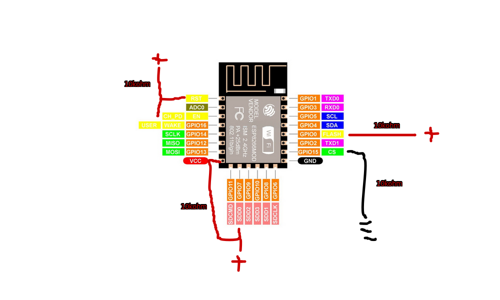

# ESP12F Setup

Basic setup, connections pulled with 10kohms resistors:

- RST + EN -> HIGH
- GPIO0 -> HIGH (when normal operation)
- GPIO0 -> LOW (when flashing)
- GPIO15 -> LOW

If deep sleep is needed and the ESP12F module can't wake up, pulling up the GPIO7 pin to high will fix the sleep routine.